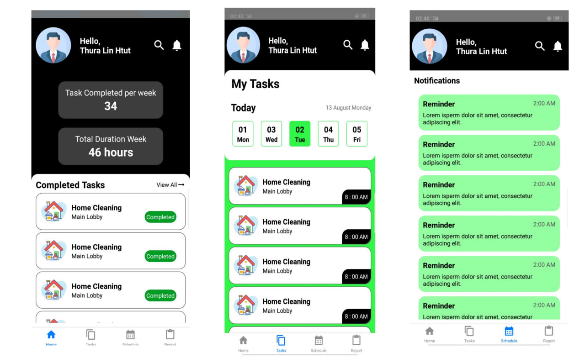

# TestBlank

**Note: This project is not finished yet. It was created as part of a technical interview for Viatick company. The project is in progress.**

## Project Description

TestBlank is a project developed as part of a technical interview for Viatick company. It aims to demonstrate the candidate's skills in building a full-stack application. The project utilizes a backend server built with Node.js and Express.js to provide APIs, while the frontend is developed using React Native.


## Project Showcase



**Screenshot:** The image above shows a sample view of the TestBlank application.

## Project Setup

To set up and run the project locally, follow these steps:

1. Clone the repository:
   
   ```
    git clone https://github.com/empiretylh/TestBlank.git
    cd TestBlank
    ```
2. Install dependencies:
   Navigate to the backend and forntend directory and run this command.

   ```
    npm install
    ```
3. Run thte backend server:

    ```
    node server.js
    ```
  
4. Run the React-Native app:

    ```
    npx react-native run-android
    npx react-native start
    ```
